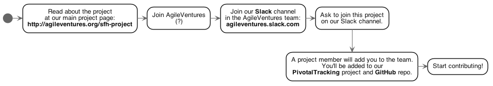

Contributing to SFH-project
---------------------------

We welcome your help and contributions.  This project is an [AgileVentures](http://AgileVentures.org) project. It is a collaborative, open project that uses Agile methods.  This GitHub repo is one part of the project. **You should read about the project on [the main project page for this project at the AgileVentures site.](http://www.agileventures.org/projects/shf-project)**  From there you'll also be able to see [the PivotalTracker page](https://www.pivotaltracker.com/n/projects/1904891), which we use to keep track of user stories and tasks.


Here is an overview of the process for joining the project so you can contribute:

    _(TODO go to the AV project page, read)_
    -> Join AV? 
    -> how/where to ask to be a member of this project? Slack? )_
      -> a project owner will add you so you'll be able to 
         work with the PivotalTracker information 
         and GitHub issues and PRs



Here is an overview of the general process for contributing (working on a new feature or fixing a bug): 
   
    
    _(TODO create an issue or feature?)_ 
    -> checkout 'develop' branch
    -> create a branch [issue #]_[title] 
    -> write test(s) to pass -> get your tests passing 
    -> create a WIP PR -> discuss, revise as needed 
    -> remove 'WIP' when your PR is ready to be merged 
    -> PR is merged by a project manager 
    -> Yay!
      
    
### Detailed Guidelines:
  - [Defining Tasks with PivotalTracker and GitHub](#Defining-Tasks-with-PivotalTracker-and-GitHub)
    - [Features](#Features)
    - [Bug fixes](#Bug-fixes)
  - [GitHub Workflow](#GitHub-Workflow)
  - [Code Style](#Code-Style)      
  
  
---


## Defining Tasks with PivotalTracker and GitHub

We use [GitHub Issues](https://github.com/AgileVentures/shf-project/issues) to manage our work on features, chores and bugfixes.
  
_(TODO how does this relate / sync with PivotalTracker? )_

Defining, discussing, voting on them...

### Features
Any feature should include Cucumber acceptance tests and where appropriate RSpec unit tests.

We try to avoid view and controller specs, and focus purely on unit tests at the model and service level where possible.  


### Bug fixes

Fixing a bug should **start with the creation of a test that replicates the bug,** so that any bugfix submission will include an appropriate test as well as the fix itself.

A bugfix may include an acceptance test depending on where the bug occurred.


_TODO_  _where should this user story go in the code?  as a cucumber acceptance test or as a documentation block?  in the github issue?_

Where possible please include a user story in the following form to indicate the higher level issue that is being addressed:

```gherkin
As an administrator
So that I can try new project metrics
I would like to be able to be able to add metrics with the minimum amount of effort

As an investigator
So that I can see how projects performed historically on new metrics
I would like to be able to apply new metrics to historical data on projects

As a metric designer
So that I can share my new metric 
I would like to be able to package my metric into a gem as simply as possible

As a project supervisor
So that I can quickly review project progress
I would like a view of metrics for a project that loads within 7 seconds, and ideally even faster 

As an administrator of another site that has projects 
So that I can quickly and reliably get stats on all our projects
I would like to be able to access the project metrics via API

```


### GitHub Workflow
  
#### develop = The branch for doing work

Our default working branch is currently `develop`.  We do work by creating branches off `develop` for new features and bugfixes.  

##### Fork the repo if you haven't already.  
Each developer will usually work with a [fork](https://help.github.com/articles/fork-a-repo/) of the [main repository on Agile Ventures](https://github.com/AgileVentures/shf-project).
 
##### ...or sync your fork before starting on a new task
Before starting work on a new feature or bugfix, please ensure you have [synced your fork to upstream/develop](https://help.github.com/articles/syncing-a-fork/):

```
git pull upstream develop
```

Note that you should be re-syncing daily (even hourly at very active times) on your feature/bugfix branch to ensure that you are always building on top of very latest _develop_ code.

 
#### Create a new branch for your work: [GitHub issue #]_[short description]
 
When you create a branch to work on your feature or bug-fix, the name of the branch should *start with the GitHub issue #,* followed by an underscore, then a few words that describe the issue (i.e. from the title of the issue).  

The format for branch names is [GitHub issue #]_[short description]

  
For example, if you are working on GitHub issue #799 and the title of that issue is "Add the CONTRIBUTING.md file", you can create and check out your branch like this:

```
git checkout -b 799_add_contributing_md
```

Once you have your tests passing (or if you're stuck and need help), create (submit) a pull request (PR).


#### Sync again before you create a PR

Before you make a pull request it is a great idea to sync again to the upstream develop branch to reduce the chance that there will be any merge conflicts arising from other PRs that have been merged to _develop_ since you started work:

```
git pull upstream develop
```


#### Create a PR early so others can review/help: WIP PR

Be sure to create your PR against the **develop** branch!

Whatever you are working on, please open a "Work in Progress" (WIP) [pull request](https://help.github.com/articles/creating-a-pull-request/) (just start your PR title with "[WIP]" )
so that others in the team can comment on your approach.  Even if you hate your horrible code :-) please throw it up there and we'll help guide your code to fit in with the rest of the project.

Once your WIP PR has been reviewed by a project manager and is ready to be merged, edit the PR title and remove "[WIP]"

Here is [more information on creating (submitting) pull requests](how_to_submit_a_pull_request_on_github.md).


##### One change per PR

Please ensure that each commit in your pull request makes a _single_ coherent change and that the overall pull request only includes commits related to the specific GitHub issue that the pull request is addressing.
This helps the project managers understand the PRs and merge them more quickly.


##### Every Pull Request (PR) should refer to a corresponding GitHub issue.
 
In your pull request description please include a sensible description of your code and a tag `fixes #<issue-id>` e.g. :

```
This PR adds a CONTRIBUTING.md file and a docs directory

fixes #799
```

which will mean that the issue is automatically linked to the pull request in the GitHub interface and when the pull request gets merged the issue will be closed.


#### Pull Request Review

The project manager(s) will review the pull request for coherence with the specified feature or bug fix, and give feedback on code quality, user experience, documentation and git style.  Please respond to comments from the project managers with explanation, or further commits to your pull request in order to get merged in as quickly as possible.

To maximize flexibility, you can add the project managers as collaborators to your projectscope fork in order to allow them to help you fix your pull request, but this is not required.


#### Here's a Diagram of Our GitHub Workflow


## Code Style


We recommend the [Ruby Style Guide](https://github.com/bbatsov/ruby-style-guide)

 