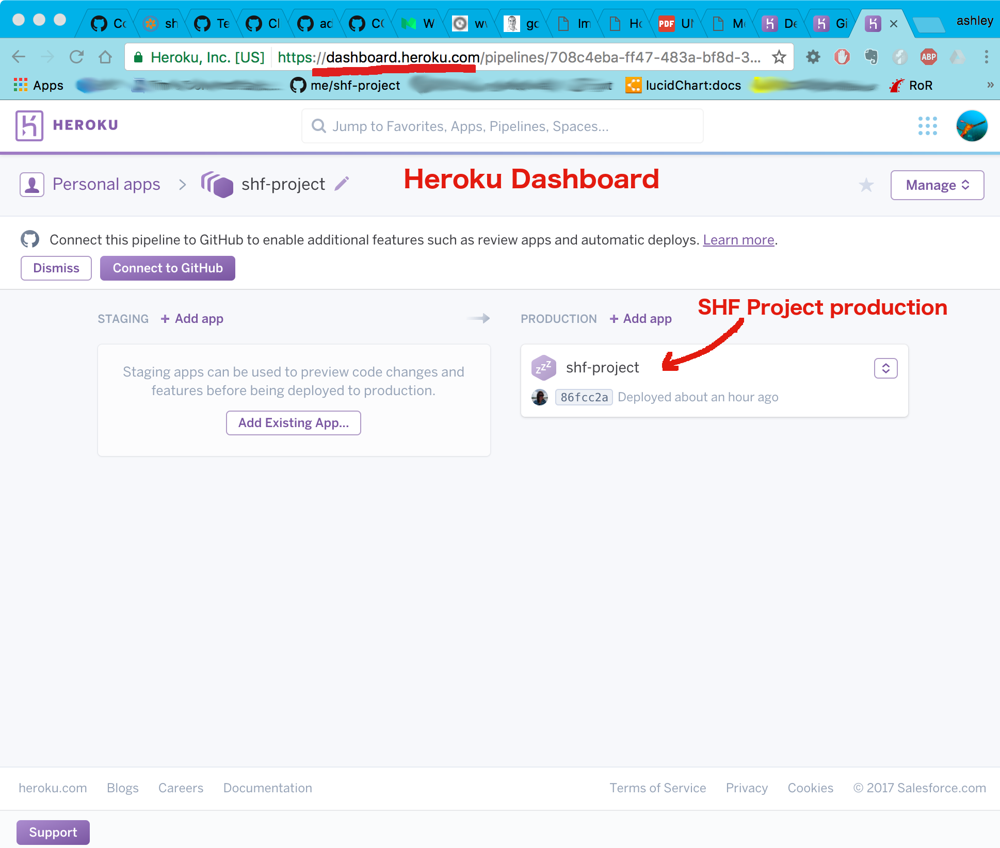
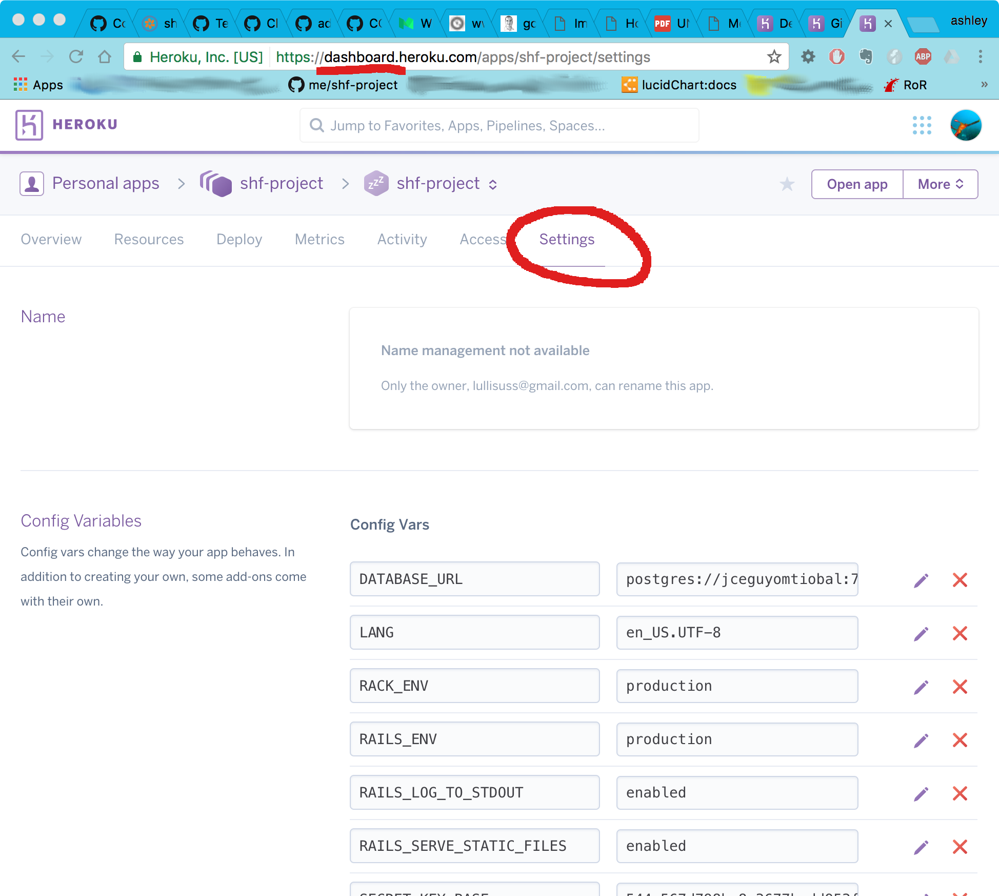

#Deploying to the Deployment and Production Servers

This is how SHF-Project gets deployed to the **development server** on [Heroku](https://heroku.com) (a place where recently merged changes to the `develop` branch can be seen)
 and the **production server** on [DigitalOcean](https://digitalocean.com) (the real system in use).

Note that there is no staging server.  This is a relatively small scale project with a small team.  Right now there's not enough value in keeping a separate staging server up and running and coordinated.

### Issues of note:

Because Heroku does not allow for files on a file system, we cannot fully test features that involve files.  Specifically:
- uploading files:  when applying for membership, users upload files that are proof of their certifications and education

*Capistrano... (Need to explain how it's used)*

### Development server on Heroku

* You must be a **collaborator** for the project on Heroku in order to manage or change the development server

To manage the development server:
* Log in to the Heroku webpage (https://heroku.com) and look at your **dashboard**
  - look for the **shf-project**
  - You can then look at the details for the project, including:
    - activity (builds, any changes to settings, etc.)
    - logs
    - collaborators
    - settings
    
    
    
  - the **Settings** show you important configuration values, like
     - Rails.env
     - Rack.env
     - passwords
     - etc.
     
     
     

* install `herokuCLI` on your local machine to be able to automatically connect and run heroku commands
     
* Automatic deploys from GitHub are set up.  When there is a push to the `develop` branch on GitHub, 
  Heroku will automatically fetch it, build it, and deploy it to the development server.
   (Note that we have the `develop` branch set up on GitHub with Continuous Integration (CI) such that there are conditions that have to be met, such as: building successfully with Semaphore, HoundCI checks, and reviews.)
     
     See [the Heroku article on GitHub Integration (Heroku GitHub Deploys)](https://devcenter.heroku.com/articles/github-integration)  for more information
     

 

### Production server on DigitalOcean

* Log in to DigitalOcean with the DO credentials for the project
* Click on the `shf...` droplet to see the details, including information for logging in via ssh

